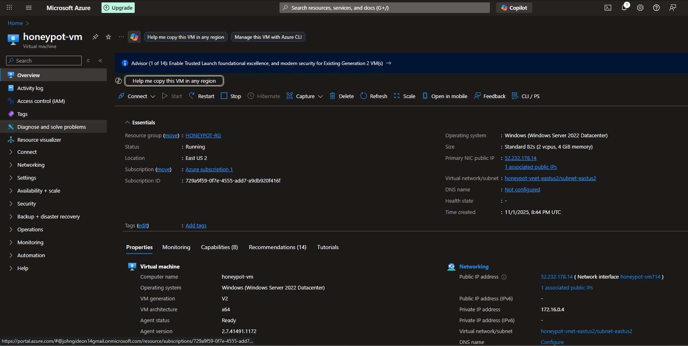
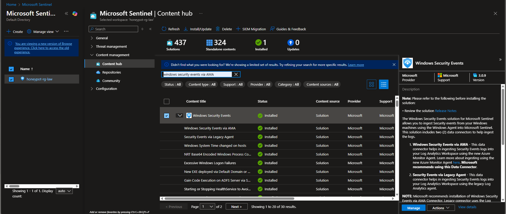
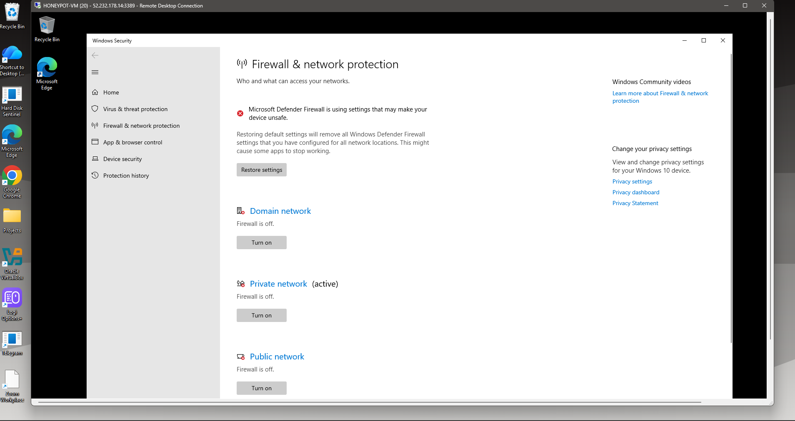
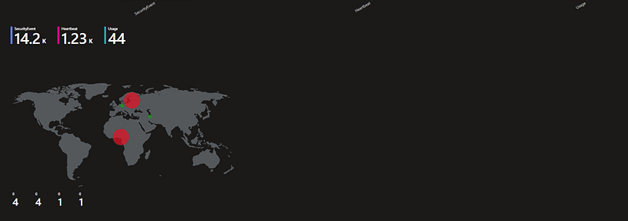
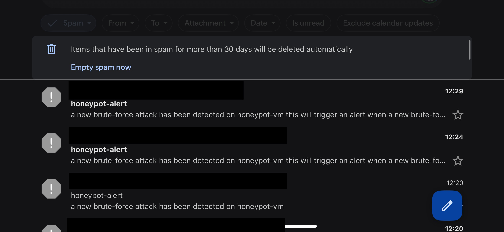

# Azure Honeypot with Microsoft Sentinel

This repository contains a complete, step-by-step guide to building a live honeypot in Microsoft Azure. The project uses a Windows Virtual Machine as the "bait," with Microsoft Sentinel as the "control room" to ingest, analyze, visualize, and alert on real-time brute-force attacks.

This system costs only a few cents to run and is an incredibly powerful, hands-on way to learn Azure, KQL, and real-world security monitoring principles.

## Final Result

The end product is a live, interactive dashboard in your Azure portal showing a world map of all the IP addresses that are actively trying to hack into your VM.

<p align="left"></p>

## Features

* **Deploy:** Builds a Windows VM and exposes its RDP port to the internet.
* **Collect:** Ingests all Windows Security Event logs (Event ID 4625 - Failed Logon) into a Log Analytics Workspace.
* **Detect & Hunt:** Uses KQL (Kusto Query Language) in Microsoft Sentinel to query and identify attacker IPs.
* **Investigate:** Includes steps to verify attacker IPs using open-source intelligence (OSINT) tools like VirusTotal.
* **Visualize:** Creates a live Sentinel Workbook dashboard that plots all attacker locations on a world map.
* **Automate:** Builds a Logic App Playbook that sends an automated email alert to your inbox for every new attack.

## Architecture

**Data Flow:**
`[Internet Attacker]` -> `[Azure NSG (Port 3389 Open)]` -> `[Windows VM (Honeypot-VM)]` -> `[Azure Monitor Agent]` -> `[Log Analytics Workspace (Honeypot-LAW)]` -> `[Microsoft Sentinel]`

**Alerting Flow:**
`[Sentinel (Analytics Rule)]` -> `[Triggers Incident]` -> `[Logic App (Playbook)]` -> `[You (Email Alert)]`

## Prerequisites

* An **Azure Subscription**. The Free Tier is sufficient, as the minor VM costs will be covered by the initial $200 credit.
* An **Email Address** (like Outlook or Gmail) to receive automated alerts.
* Basic familiarity with navigating the Azure Portal.

---

## Step-by-Step Guide

### Part 1: The Foundation (Sentinel Setup)

#### Step 1: Create a Resource Group
This will contain all your project assets.
1.  In the Azure Portal, search for `Resource groups`.
2.  Click **+ Create**.
3.  **Name:** `honeypot-rg`
4.  **Region:** Select a region (e.g., `East US 2`). **All other resources must be in this same region.**

<p align="left"></p>


#### Step 2: Create a Log Analytics Workspace (LAW)
This is the database that will store all our logs.
1.  Search for `Log Analytics workspaces`.
2.  Click **+ Create**.
3.  **Resource Group:** Select `honeypot-rg`.
4.  **Name:** `honeypot-rg-law`
5.  **Region:** `East US 2`
6.  Click **Review + create**, then **Create**.

<p align="left"></p>


#### Step 3: Deploy Microsoft Sentinel
This is the security "brain" that will analyze the logs.
1.  Search for `Microsoft Sentinel`.
2.  Click **+ Create**.
3.  Select the `honeypot-rg-law` you just created from the list.
4.  Click **Add** to enable Sentinel.

<p align="left"></p>


---

### Part 2: The Target (The VM)

#### Step 4: Create the Virtual Machine
This is the "honeypot."
1.  Search for `Virtual machines`.
2.  Click **+ Create** > **Azure virtual machine**.
3.  **Basics Tab:**
    * **Resource Group:** `honeypot-rg`
    * **Virtual machine name:** `honeypot-vm`
    * **Region:** `East US 2`
    * **Image:** `Windows Server 2022 Datacenter - x64 Gen2`.
        * **Note:** Make sure the publisher is **`MicrosoftWindowsServer`**. Do *not* select third-party images, as they may be blocked on a free-tier subscription.
    * **Size:** `Standard_B2s` (2 vCPUs, 4 GiB RAM).
        * **!! CRITICAL !!:** Do **not** use the `B1s` (1 GiB) size. The Windows Server GUI is likely to crash with a `DWM.exe` error upon RDP login due to insufficient RAM.
    * **Administrator account:**
        * **Username:** (e.g., `localadmin or admin-vm`)
        * **Password:** (e.g., `P@ssw0rd12345!`) - Make it strong and save it.
    * **Public inbound ports:** Select `Allow selected ports`.
    * **Select inbound ports:** Check **`RDP (3389)`**. This is the "open door" for our trap.
4.  **Networking Tab:**
    * Ensure the `honeypot-vm-nsg` (Network Security Group) is set to `Basic`.
    * Confirm you see the `Allow` rule for `RDP (3389)`.
5.  Click **Review + create**, then **Create**.

<p align="left"></p>


---

### Part 3: Connecting the Logs

#### Step 5: Connect VM Logs to Sentinel
This deploys an agent to the VM to stream its logs.
1.  Navigate to **Microsoft Sentinel** and select your workspace.
2.  Under "Content management," click **Content hub**.
3.  Search for **"Windows Security Events"** and click **Install**.
4.  Once installed, click **Manage**.
5.  On the connector page (it may be called "Windows Security Events via AMA"), click **+ Create data collection rule**.
6.  **Rule name:** `honeypot-vm-logs`
7.  **Resource Group:** `honeypot-rg`
8.  **On the "Resources" tab:** Select your `honeypot-vm`.
9.  **On the "Collect" tab:** Select **"All Security Events"**.
10. Click **Review + create**, then **Create**. This will take a few minutes to deploy the agent.

<p align="left"></p>


#### Step 6: "Arm" the Honeypot (The 'Smart' Way)
This is the final step to make the VM vulnerable. We will turn off the internal Windows Firewall.

**Crucial Pro-Tip:** You must use the modern **Windows Settings** page. If you use the old **Server Manager** (`firewall.cpl`), it will kill the firewall service and instantly terminate your RDP session, locking you out.

1.  Log in to your `honeypot-vm` using Remote Desktop.
2.  Open the **Start Menu** and click the **Settings** gear icon.
3.  In the Settings app, go to **Privacy & security** (or **Update & Security**).
4.  Click on **Windows Security**.
5.  Click on **Firewall & network protection**.
6.  You will see three profiles: **Domain**, **Private**, and **Public**. Click on each one and toggle the **"Microsoft Defender Firewall"** switch to **Off**.
7.  You will *not* be kicked out of your RDP session. The honeypot is now fully armed and exposed, and all attack attempts will be logged.

<p align="left"></p>

---

### Part 4: The Hunt (KQL Queries)

**Wait 1-2 hours.** You must be patient for automated scanners to find your VM's IP and for the logs to sync.

**Step 7:** Run Your First Hunt
1.  Go to **Microsoft Sentinel** > **Logs**.
2.  Paste this query to find all failed RDP logins (`EventID 4625`).
    ```kql
    SecurityEvent
    | where EventID == 4625
    | where AccountType == "User"
    | summarize FailedLogonCount = count() by IpAddress, TargetUserName
    | order by FailedLogonCount desc
    ```
3.  **Note your own IP:** You will see your *own* failed login attempts. Find your public IP (Google "what is my IP") and note it. For this guide, we'll use `98.97.79.84` as the example.


**Step 8:** Filter for Attackers Only
Now, modify the query to filter *out* your own IP, showing you *only* the real attackers.
```kql
SecurityEvent
| where EventID == 4625
| where AccountType == "User"
| where IpAddress != ""  // <-- REPLACE WITH YOUR IP
| summarize FailedLogonCount = count() by IpAddress, TargetUserName
| order by FailedLogonCount desc
```
You will now see a clean list of attacker IPs and the usernames they are guessing.

<p align="left"></p>


### Part 5: Investigation & Visualization
**Step 9: Investigate an Attacker**
Is the IP really malicious?

Copy an attacker's IP from your query results.

Open a new tab and go to https://www.virustotal.com.

Click the "Search" tab, paste the IP, and press Enter.

View the "Detection" score (e.g., 12/95). This confirms the IP is a known bad actor.

<p align="left"></p>


**Step 10: Build the Live Attack Map (Workbook)**
The "Logs" query chart is buggy. A Workbook is the correct tool for this.

Go to Microsoft Sentinel > Workbooks.

Click + Add `workbook`, then click `Edi`t (pencil icon).

Click + Add and select Add query.

Paste in the final, working KQL query for the map:

Code snippet

```kql
SecurityEvent
| where EventID == 4625
| where AccountType == "User"
| where IpAddress != "98.97.79.84"  // <-- REPLACE WITH YOUR IP
| summarize AttackCount = count() by IpAddress
| extend GeoData = geo_info_from_ip_address(IpAddress)
| project CountryOrRegion = GeoData.country, Latitude = GeoData.latitude, Longitude = GeoData.longitude, AttackCount, IpAddress
```

Below the query, set the Visualization dropdown to "Map".

Click the blue "Run Query" button. You will see the live map.

Click Done Editing, then Save (floppy disk icon) to save your new dashboard.

<p align="left"></p>

### Part 6: Automation (Email Alerts)
**Step 11: Create the Playbook (Logic App)**
This is the workflow that sends the email.

Go to Microsoft Sentinel > Automation.

Click + Create > Playbook with incident trigger.

Name: `honeypot-send-email-alert`

Resource Group: `honeypot-rg`

Click `Create`, then Go to `resource`.

In the Logic App Designer, click + New step.

Search for "Send an email (V2)" (for Outlook.com / Office 365) or "Send email" (for Gmail).

Sign in to your email account to grant permission.

Fill out the template:

To: Your email address

Subject: HONEYPOT ALERT: `New Brute-Force Attack!`

Body: A new attack was detected on the honeypot. Attacker IP: [Add 'IP Address' dynamic content here]

Click `Save`.

<p align="left"></p>

**Step 12: Create the Analytics (Alert) Rule**
This rule runs our query and triggers the playbook.

Go to Microsoft Sentinel > Analytics.

Click + Create > Scheduled query rule.

General tab:

Name: `Honeypot-Send-Email-Alert`

Set rule logic tab:

Rule query: Paste your "attacker-only" query from Step 8.

Query scheduling: Set to Run query every 5 minutes and Lookup data from the last 5 minutes.

Alert threshold: Set Is greater than to 0.

<p align="left"></p>


Automated response tab:

Click + `Add new`.

Name: `honeypot-email-automation`

Actions: + Add action > Run playbook > Check the box for Honeypot-Send-Email-Alert.

!! PERMISSION FIX !!: If you see a red error, click the "grant permission" link. Or, manually add the "Microsoft Sentinel Automation Contributor" role to the "Microsoft Sentinel" managed identity in your Honeypot-RG's IAM panel.

Click `Apply`, then `Revie`w + `create`, then `Create`.

<p align="left"></p>

The project is now 100% complete and automated.


### Project Cleanup (IMPORTANT)
When you are finished, you must delete the resources to stop all charges.

Go to Resource groups.

Select your `honeypot-rg`.

Click Delete resource group.

Type the name Honeypot-RG to confirm and click Delete.

This will destroy all assets related to this project.
